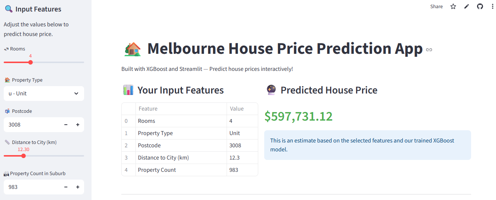

# Melbourne House Price Prediction App
## App Interface

## About the project
Datasource: [Kaggle](https://www.kaggle.com/datasets/dansbecker/melbourne-housing-snapshot)

In this project, we will use linear regression with the `scikit-learn` and `XGBoost` libraries in Python to predict housing prices in Melbourne. The goal is to predict house prices based on user-provided data.

We will use data cleaning and preprocessing techniques to prepare the data for analysis.

Next, we will use linear regression to model the relationship between house characteristics and its market price. To assess the model's quality, we will use metrics such as R² and MSE.

Finally, we create a web application using Streamlit that can predict the value of a property based on user-provided data. We will analyze the results and understand the project's business vision, which can be useful for real estate professionals, investors, and even individuals looking to buy a home.
## Data Description
The variables in the dataset are:
- **`Rooms`**: Number of rooms.
- **`Price`**: Price in dollars.
- **`Method`**: S - property sold; SP - property sold prior; PI - property passed in; PN - sold prior not disclosed; SN - sold not disclosed; NB - no bid; VB - vendor bid; W - withdrawn prior to auction; SA - sold after auction; SS - sold after auction price not disclosed; N/A - price or highest bid not available.
- **`Type`**: br - bedroom(s); h - house/cottage/villa/semi/terrace; u - unit/duplex; t - townhouse; dev site - development site; o res - other residential.
- **`SellerG`**: Real estate agent.
- **`Date`**: Date sold.
- **`Distance`**: Distance from CBD
- **`Regionname`**: General Region (West, North West, North, North East etc.)
- **`Propertycount`**: Number of properties that exist in the suburb.
- **`Bedroom2`**: Scraped # of bedrooms (from different source)
- **`Bathroom`**: Number of bathrooms
- **`Car`**: Number of carspots
- **`Landsize`**: Land size
- **`BuildingArea`**: Building size
- **`CouncilArea`**: Governing council for the area
## Project Steps
1. Importing libraries and loading dataset
2. Data Preprocessing
3. Exploratory Data Analysis
4. Model training and evaluation with `XGBoost`
5. Visualizing predictions
6. Making sample prediction
7. Saving model using `joblib`
